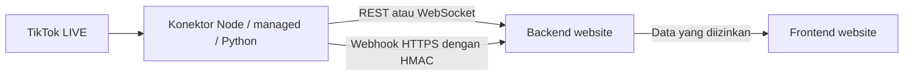

# Integrasi website lain ke TikTok Live Konektor

Panduan ini menghubungkan backend website Anda ke layanan `tiktok-live-konektor`. Ganti semua domain contoh dengan URL deployment Anda. Contoh URL `https://tiktok-live-konektor.onrender.com` bukan bukti bahwa deployment itu tersedia atau broadcaster sedang LIVE.

## 1. Pilih jalur integrasi



| Kebutuhan | Pilihan |
| --- | --- |
| Status, jumlah viewer, like dan gift | REST dari backend/proxy website |
| Overlay/chat/game realtime | Satu `/live` WebSocket di backend, lalu relay ke frontend |
| Memicu workflow server | Webhook HTTPS dengan verifikasi HMAC dan idempotency |
| Mulai/berhenti LIVE dan konfigurasi | Dashboard admin konektor |

Consumer tidak perlu menjalankan konektor TikTok sendiri. `/api/v1/*` hanya membaca data. `/socket.io` memerlukan cookie dashboard dan bukan endpoint integrasi consumer.

## 2. Atur environment dan aktifkan LIVE

| Lokasi | Variabel | Nilai yang digunakan |
| --- | --- | --- |
| Server konektor | `API_KEY` | Secret acak minimal 32 karakter untuk REST dan `/live` |
| Backend website | `TLK_API_KEY` | Nilai yang sama dengan `API_KEY` konektor |
| Backend website | `TLK_BASE_URL` | Origin HTTPS deployment konektor, tanpa path |
| Konektor dan receiver webhook | `WEBHOOK_SIGNING_SECRET` | Secret acak minimal 32 karakter yang sama di kedua server |
| Konektor | `TIKTOK_USERNAME` | Username broadcaster tanpa `@` |
| Konektor | `EULER_API_KEY` | Key Eulerstream dengan akses signer/gateway yang sesuai |
| Konektor | `API_ALLOWED_ORIGINS` | Hanya untuk request consumer yang membawa `Origin` |

Konfigurasi dasar produksi (`ADMIN_USERNAME`, password awal, JWT secret, WS token dan storage persisten) ada di [README](../README.md#konfigurasi-environment). Blueprint Node menghasilkan secret; salin hanya secret yang diperlukan ke secret manager backend consumer. Jangan memakai prefix `VITE_`/`NEXT_PUBLIC_` untuk secret.

Untuk integrasi backend tanpa header `Origin`, `API_ALLOWED_ORIGINS` boleh kosong. Bila request memang membawa `Origin`, daftar harus mencocokkan `scheme://host[:port]` persis, tanpa path atau trailing slash. Contoh: `https://website-a.example,https://website-b.example`. CORS bukan autentikasi, dan proteksi proxy website harus diatur pada proxy itu sendiri.

Saat ini konektor memakai **satu API key dan satu secret signing bersama**; belum mendukung key berbeda per consumer. Rotasi memengaruhi semua consumer. `WS_TOKEN` adalah alternatif autentikasi WebSocket saja, bukan key REST, dan cookie admin tetap terpisah.

Login dashboard, isi username/Room ID bila perlu, lalu klik **Start LIVE** saat broadcaster sedang siaran. Engine dapat berupa `node`, `managed`, `python`, atau `none`. Node mencoba managed gateway pada error Business-plan jika Euler key ada, kemudian Python bila fallback dikonfigurasi. Health sukses atau WS terbuka belum membuktikan LIVE aktif: periksa `status: Connected` dan event nyata; `running: true` juga dapat berarti sedang connecting.

## 3. REST API dari backend

| Method | Endpoint | Auth | Respons |
| --- | --- | --- | --- |
| GET | `/api/health` | Publik | `ok`, `status`, `engine` |
| GET | `/api/v1/status` | API key | `ok`, `status`, `engine`, `running`, `username`, `roomId`, `lastEventAt`, `stats`, availability fallback |
| GET | `/api/v1/stats` | API key | `ok`, `username`, `roomId`, `stats` |
| GET | `/api/v1/events` | API key | `ok`, `count`, `events` terbaru dulu |

Gunakan `Authorization: Bearer <API_KEY>` atau `X-API-Key: <API_KEY>`. Tidak ada kebutuhan cookie login pada endpoint ini.

Dari terminal/backend yang telah mendapatkan environment melalui secret manager:

```bash
# TLK_BASE_URL dan TLK_API_KEY harus sudah diinjeksi; jangan menulis secret di history shell.
curl --fail-with-body "$TLK_BASE_URL/api/health"
curl --fail-with-body -H "Authorization: Bearer $TLK_API_KEY" "$TLK_BASE_URL/api/v1/status"
curl --fail-with-body -H "Authorization: Bearer $TLK_API_KEY" \
  "$TLK_BASE_URL/api/v1/events?type=chat,like,gift&limit=20"
```

Opsi event history:

- `type`: daftar dipisahkan koma. Jenis publik: `chat`, `like`, `gift`, `follow`, `share`, `member`, `viewer`, `stream`. Tanpa filter berarti semua jenis publik.
- `limit`: gunakan integer `1–200`; default `50`.
- `before`: ISO timestamp yang valid; hanya event **lebih lama** dari waktu itu dikembalikan. Gunakan `URLSearchParams` untuk encoding.

Contoh server-side Node 24:

```js
// status.mjs — environment diinjeksi di backend website.
const base = new URL(process.env.TLK_BASE_URL);
const key = process.env.TLK_API_KEY;
if (!key) throw new Error('TLK_API_KEY wajib diisi');
const url = new URL('/api/v1/events', base);
url.searchParams.set('type', 'chat,like,gift');
url.searchParams.set('limit', '20');
const response = await fetch(url, {
  headers: { Authorization: `Bearer ${key}` },
  signal: AbortSignal.timeout(10_000),
  redirect: 'error'
});
if (!response.ok) throw new Error(`Konektor HTTP ${response.status}`);
const { events } = await response.json();
console.log(events.map(({ id, event }) => ({ id, event })));
```

Polling memakai history yang terbatas, bukan cursor durable. Hindari interval cepat: REST dibatasi global 120 request/menit per IP bersama request HTTP lain. Untuk realtime gunakan WebSocket. History default maksimal 500 event, hingga 2000 sesuai konfigurasi; restart menghapus history dan statistik. `before` tidak menjamin recovery semua event yang terlewat.

## 4. Cloudflare Pages + Worker sebagai proxy REST

Pasang Worker pada route `https://website-anda.example/api/tiktok/*`. Isi `TLK_API_KEY` sebagai **Worker secret** dan `TLK_BASE_URL` sebagai variabel konfigurasi. Pages frontend hanya memanggil proxy miliknya, tanpa API key konektor.

Contoh ini mempublikasikan status/event kepada pengunjung website. Bila data terbatas untuk pengguna tertentu, tambahkan autentikasi dan otorisasi pengguna **sebelum fetch upstream**; API key Worker tidak melindungi endpoint publik Worker.

```js
// worker.js
export default {
  async fetch(request, env) {
    const input = new URL(request.url);
    const prefix = '/api/tiktok/';
    const action = input.pathname.startsWith(prefix) ? input.pathname.slice(prefix.length) : '';
    if (request.method !== 'GET' || !['status', 'stats', 'events'].includes(action)) {
      return new Response('Not found', { status: 404 });
    }
    if (!env.TLK_API_KEY || !env.TLK_BASE_URL) {
      return Response.json({ error: 'Konfigurasi proxy belum lengkap' }, { status: 503 });
    }
    try {
      const base = new URL(env.TLK_BASE_URL);
      if (base.protocol !== 'https:' || base.username || base.password ||
          base.pathname !== '/' || base.search || base.hash) {
        return Response.json({ error: 'TLK_BASE_URL harus origin HTTPS' }, { status: 503 });
      }
      const upstream = new URL('/api/v1/' + action, base);
      if (action === 'events') {
        upstream.searchParams.set('type', input.searchParams.get('type') || 'chat,like,gift');
        const limit = Number(input.searchParams.get('limit') || 20);
        if (!Number.isInteger(limit) || limit < 1 || limit > 200) {
          return Response.json({ error: 'limit harus integer 1–200' }, { status: 400 });
        }
        upstream.searchParams.set('limit', String(limit));
        const before = input.searchParams.get('before');
        if (before) {
          if (!Number.isFinite(Date.parse(before))) return Response.json({ error: 'before tidak valid' }, { status: 400 });
          upstream.searchParams.set('before', before);
        }
      }
      const response = await fetch(upstream, {
        headers: { Authorization: 'Bearer ' + env.TLK_API_KEY },
        signal: AbortSignal.timeout(10_000),
        redirect: 'error',
        cf: { cacheTtl: 0 }
      });
      return new Response(response.body, {
        status: response.status,
        headers: { 'Content-Type': 'application/json; charset=utf-8', 'Cache-Control': 'no-store' }
      });
    } catch {
      return Response.json({ error: 'Upstream tidak dapat dihubungi' }, { status: 502 });
    }
  }
};
```

Pada frontend yang memiliki origin sama dengan Worker:

```js
const response = await fetch('/api/tiktok/status');
if (!response.ok) throw new Error(`Proxy HTTP ${response.status}`);
const { status, engine, stats } = await response.json();
// Render data sesuai kebutuhan website; tidak ada secret pada kode browser.
console.log({ status, engine, stats });
```

Worker di atas tidak meneruskan `Origin`, cookie atau Authorization pengguna ke konektor; hanya API key backend yang dikirim. Jika proxy berada di domain berbeda dari frontend, atur CORS spesifik pada Worker dan proteksi akses di sana.

## 5. WebSocket realtime di backend website

Endpoint `/live` menggunakan WebSocket biasa, bukan protokol Socket.IO. Header `Authorization: Bearer <API_KEY>` atau `<WS_TOKEN>` diterima. Filter `?events=chat,like,gift` (alias `?types=...`) membatasi jenis pesan. Tanpa filter semua event yang disiarkan diterima. Gunakan nama event yang didukung; filter berisi hanya jenis yang tidak dikenal jatuh kembali ke `chat,like,gift`.

Pasang dependency `ws` di proyek backend consumer:

```bash
npm install ws
```

```js
// consumer.mjs — jalankan satu consumer pada backend website.
import WebSocket from 'ws';

const base = new URL(process.env.TLK_BASE_URL);
if (base.protocol !== 'https:' || base.username || base.password) throw new Error('Gunakan origin HTTPS konektor');
const key = process.env.TLK_API_KEY;
if (!key) throw new Error('TLK_API_KEY wajib diisi');
const endpoint = new URL('/live', base);
endpoint.protocol = 'wss:';
endpoint.searchParams.set('events', 'chat,like,gift');
let retryMs = 2000;
let stopping = false;
let timer;
let socket;

function connect() {
  socket = new WebSocket(endpoint, {
    headers: { Authorization: 'Bearer ' + key }, handshakeTimeout: 10_000, maxPayload: 256 * 1024
  });
  socket.on('open', () => { retryMs = 2000; console.info('Transport realtime tersambung'); });
  socket.on('message', raw => {
    let event;
    try { event = JSON.parse(raw.toString()); } catch { return; }
    if (!event.id || !['chat', 'like', 'gift'].includes(event.event)) return;
    // Relay hanya data yang diizinkan ke browser melalui SSE/Socket.IO milik website.
    // Untuk reward, simpan ID dan proses gift streak secara idempotent di database.
    console.info({ id: event.id, type: event.event });
  });
  socket.on('error', () => console.warn('Koneksi realtime gagal; cek status/auth/log server'));
  socket.on('close', () => {
    if (stopping) return;
    timer = setTimeout(connect, retryMs + Math.floor(Math.random() * 1000));
    retryMs = Math.min(retryMs * 2, 60_000);
  });
}
function stop() { stopping = true; clearTimeout(timer); socket?.terminate(); }
process.once('SIGTERM', stop);
process.once('SIGINT', stop);
connect();
```

`ws` merespons heartbeat ping secara otomatis. Koneksi eksternal dibatasi 30 percobaan/menit per IP; kurangi reconnect pada 401/403 dan perbaiki konfigurasi. Jangan log URL dengan credential. Perubahan API key memerlukan restart/reconnect consumer dengan nilai baru; koneksi yang sudah terbuka tidak dicabut otomatis hanya oleh rotasi environment.

Mode browser langsung (`?key=<API_KEY>` atau `?token=<WS_TOKEN>`) masih didukung untuk klien terkontrol dengan `API_ALLOWED_ORIGINS` yang sesuai. Pada website publik, gunakan relay backend: credential query dapat dibaca pengguna dan tersimpan di log. Socket baru tidak menerima replay history; ambil REST history jika perlu dan deduplikasi terhadap pesan realtime.

## 6. Webhook dengan verifikasi HMAC

1. Isi `WEBHOOK_SIGNING_SECRET` yang sama pada konektor dan backend receiver. Gunakan secret terpisah dari API/JWT/WS.
2. Siapkan receiver HTTPS publik, misalnya `https://website-anda.example/hooks/tiktok`. Sertifikat TLS harus valid.
3. Dashboard admin → **Integrasi Webhook** → tambah URL → pilih event → aktifkan → **Simpan webhook**. Daftar event kosong berarti semua jenis yang disiarkan.
4. Mulai LIVE dan periksa receipt di receiver. Tidak ada tombol/API test webhook khusus saat ini; tes sintetik receiver tidak membuktikan delivery dari TikTok.

Konfigurasi target yang disimpan lewat `PUT /api/webhooks` (cookie admin, bukan API key):

```json
{"webhooks":[{"url":"https://website-anda.example/hooks/tiktok","enabled":true,"events":["chat","gift"]}]}
```

Maksimal 20 target; URL duplikat, IP literal, local/private DNS, kredensial URL dan fragment ditolak. DNS diperiksa dan dipin saat TLS terhubung; redirect tidak diikuti. Semua target memakai signing secret yang sama.

Header delivery:

| Header | Makna |
| --- | --- |
| `x-tlk-event-id` | Metadata ID event; gunakan ID dalam body setelah signature valid |
| `x-tlk-event-version` | Metadata versi event, saat ini `1` |
| `x-tlk-timestamp` | Waktu Unix saat setiap percobaan delivery, dalam detik |
| `x-tlk-signature` | `sha256=` diikuti hex HMAC-SHA256 |

Materi signature adalah **timestamp + titik + byte raw body**, bukan JSON yang diserialisasi ulang. Header ID/version tidak masuk materi signature. Payload body yang telah diverifikasi menjadi sumber ID/version terpercaya.

Pasang `express` pada proyek receiver. Contoh berikut adalah receiver uji lengkap; deduplikasi memorinya bukan penyimpanan transaksi produksi.

```bash
npm install express
# Injeksi WEBHOOK_SIGNING_SECRET ke environment, lalu:
node receiver.mjs
```

```js
// receiver.mjs — letakkan route raw body SEBELUM app.use(express.json()).
import crypto from 'node:crypto';
import express from 'express';

const secret = process.env.WEBHOOK_SIGNING_SECRET;
if (!secret || secret.length < 32) throw new Error('WEBHOOK_SIGNING_SECRET minimal 32 karakter');
const app = express();
const receipts = new Map();
app.post('/hooks/tiktok', express.raw({ type: 'application/json', limit: '256kb' }), (req, res) => {
  if (!Buffer.isBuffer(req.body)) return res.sendStatus(415);
  const timestamp = String(req.headers['x-tlk-timestamp'] || '');
  const signature = String(req.headers['x-tlk-signature'] || '');
  if (!/^\d{10}$/.test(timestamp) || Math.abs(Date.now() / 1000 - Number(timestamp)) > 300 ||
      !/^sha256=[a-f0-9]{64}$/.test(signature)) return res.sendStatus(401);
  const expected = crypto.createHmac('sha256', secret).update(timestamp + '.').update(req.body).digest();
  const supplied = Buffer.from(signature.slice(7), 'hex');
  if (!crypto.timingSafeEqual(expected, supplied)) return res.sendStatus(401);
  let event;
  try { event = JSON.parse(req.body.toString('utf8')); } catch { return res.sendStatus(400); }
  if (!event || typeof event.id !== 'string' || !event.id || typeof event.event !== 'string') return res.sendStatus(400);
  const now = Date.now();
  for (const [id, expiry] of receipts) if (expiry <= now) receipts.delete(id);
  if (receipts.has(event.id)) return res.sendStatus(204);
  if (receipts.size >= 10_000) return res.sendStatus(503);
  // Pada produksi: simpan event.id dengan UNIQUE constraint dan perubahan bisnis
  // dalam transaksi database, atau enqueue secara durable sebelum mengirim 2xx.
  receipts.set(event.id, now + 24 * 60 * 60 * 1000);
  console.info({ receivedId: event.id, type: event.event });
  return res.sendStatus(204);
});
app.use(express.json());
const server = app.listen(Number(process.env.PORT || 8080), '0.0.0.0', () => {
  console.info('Receiver listening on ' + server.address().port);
});
```

Untuk aplikasi yang sudah memakai JSON parser global, pindahkan route ini ke atas parser atau capture raw body dengan hook `verify`; jangan mencoba memperoleh signature dari `JSON.stringify(req.body)`. Toleransi timestamp contoh ±5 menit memerlukan jam server yang sinkron.

Receiver mengirim `2xx` hanya setelah pekerjaan diterima secara durable pada produksi. Konektor mencoba ulang respons non-2xx/error/timeout, default tiga retry setelah percobaan pertama, timeout 5 detik. Signature/timestamp dibuat ulang tiap percobaan; ID/body event tetap sama. Job dibatasi empat aktif dan 200 menunggu; overflow dan restart dapat kehilangan delivery. Antrean ini best-effort, bukan exactly-once.

## 7. Format event dan gift streak

Contoh ilustrasi:

```json
{
  "id":"9a18b3d0-33c9-4489-9ca2-e611f7baf784",
  "event":"gift",
  "timestamp":"2026-10-11T01:05:00.000Z",
  "roomId":"7693584931198438164",
  "username":"penyiar_contoh",
  "version":1,
  "data":{
    "username":"viewer_contoh","nickname":"Viewer",
    "giftId":"5655","giftName":"Rose","repeatCount":3,"repeatEnd":true,
    "giftType":1,"streakable":true,"diamondCount":1,"totalValue":3
  }
}
```

`username` tingkat atas adalah penyiar; `data.username` adalah aktor event. `roomId` dapat null. Metadata gift tidak dijamin lengkap: pakai `giftId` untuk aturan stabil bila nama tidak ada. Payload terlalu besar dapat diganti `data.truncated: true`; periksa sebelum memproses field bisnis.

Deduplikasi `event.id` mencegah pemrosesan **event yang sama** akibat retry atau overlap REST/realtime. Gift streak dapat menghasilkan **beberapa ID berbeda** dengan `repeatCount` kumulatif: misalnya 1, 2, 3. Menjumlahkan 1+2+3 memberi hasil salah. Gunakan delta repeatCount untuk streak aktif atau proses total saat `repeatEnd` sesuai kebutuhan, dengan penanganan restart/akhir streak. Jangan menganggap `totalValue` sebagai delta, uang tunai, atau bukti transaksi finansial.

`stats` meliputi `chat`, `likes`, `gifts`, `giftCoins`, `follows`, `viewerCount`, `peakViewers`, `topGifter`. History/statistik hilang saat restart. LIVE sehat tidak menjamin semua event diterima; simpan data penting pada consumer dengan aturan idempotency yang sesuai.

## 8. Verifikasi dan troubleshooting

| Gejala | Periksa |
| --- | --- |
| REST/WS `401` | Key salah/tidak dikirim; REST hanya menerima API_KEY, bukan WS_TOKEN |
| Request dengan Origin `403` | Exact origin consumer belum diizinkan; endpoint admin hanya menerima origin dashboard yang sama |
| REST `/api/v1/*` `503` | API_KEY belum dikonfigurasi |
| Login/sesi admin gagal | Kredensial dashboard terpisah; logout/perubahan password mencabut sesi; produksi memerlukan HTTPS untuk cookie Secure |
| `429` | Kurangi polling/reconnect; HTTP 120/menit, login 10/15 menit, WS 30 percobaan/menit per IP |
| Health sukses, event kosong | Pastikan Start LIVE berhasil dan broadcaster aktif; periksa status Connected dan entitlement signer/gateway |
| Error Business plan | Community key tidak mengizinkan Business signing; cek akses Cloud WebSocket atau Python yang dikonfigurasi |
| Webhook tidak bisa diaktifkan | Signing secret produksi belum diisi, URL tidak memenuhi syarat, atau target duplikat |
| Receiver menolak HMAC | Secret berbeda, body diparse/diserialisasi ulang, signature format salah atau jam selisih lebih dari 5 menit |
| Webhook gagal dikirim | TLS/DNS/allowlist, redirect, HTTP non-2xx, timeout atau antrean penuh; periksa log kedua service |
| Koin terhitung ganda | Deduplikasi ID dan penanganan repeatCount kumulatif gift streak harus terpisah |
| Data hilang setelah reconnect | WebSocket tidak replay; REST history terbatas dan tidak persisten |
| Python tidak tersedia | Deploy service terpisah, atur origin HTTPS dan token yang sama di kedua service |

Sebelum digunakan: verifikasi REST autentikasi, sambungan WS, signature salah ditolak, duplicate tidak diproses dua kali, event TikTok nyata diterima dan tidak ada credential pada frontend. Tes receiver lokal/sintetik memeriksa handler; delivery upstream nyata tetap perlu diuji pada deployment Anda.
